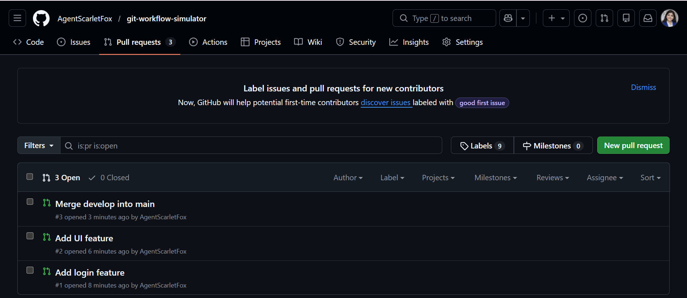
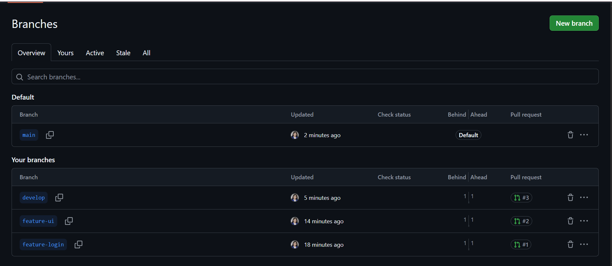
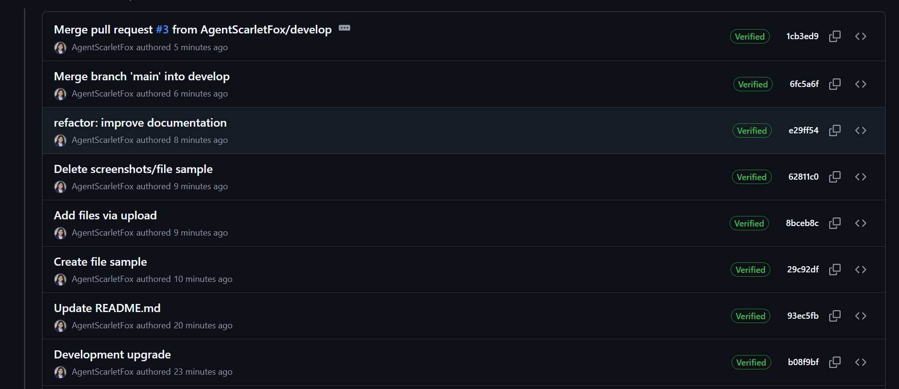

# git-workflow-simulator

## 🔧 Development Update
This change is added in develop branch to differentiate it from main.
Improved workflow documentation clarity
# 🚀 Git Workflow Simulator

## 🧠 Objective
This project simulates a real-world Git workflow using branching strategies, pull requests, and structured commits.

---

## ⚙️ Workflow Used
- main → production branch  
- develop → integration branch  
- feature branches → parallel development  

---

## 🌿 Branch Structure
- main  
- develop  
- feature-login  
- feature-ui  

---

## 🔀 Pull Requests
1. feature-login → develop  
2. feature-ui → develop  
3. develop → main  

---

## 📸 Proof of Work

### 🔹 Pull Requests

### 🔹 Branches

### 🔹 Commit History

---

## 🧠 What I Learned
- Feature branching strategy  
- Pull request workflow  
- Merge process  
- Version control best practices  

---

### Integration Update
Features merged into develop branch

## 📊 Outcome
This project demonstrates how professional developers manage code using Git workflows.
